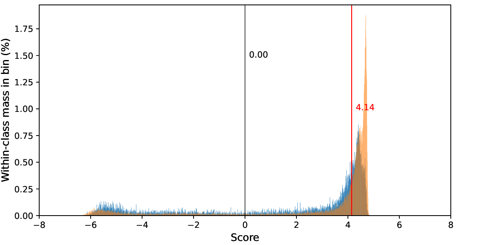
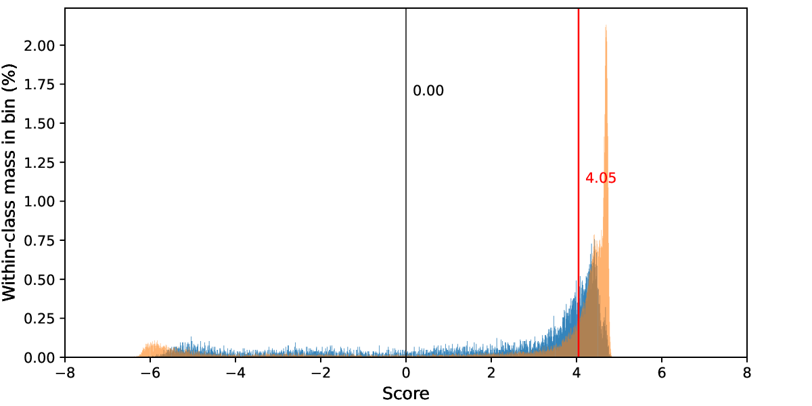

# APSIPA RADAR Challenge 2026 Baseline - SSL AASIST Anti-spoofing

This repository provides a baseline inference pipeline for the APSIPA RADAR Challenge 2026. Updated version included evaluation scripts for RADAR2026-dev set.

## Model Summary
- Architecture: Wav2Vec 2.0 SSL frontend with an AASIST classifier
- Training data: ASVspoof2019 LA
- Augmentation: RawBoost
- Model size: 300M

## Introduction
This repository contains inference code for APSIPA RADAR Challenge 2026, based on the [SSL AASIST Audio Deepfake Detection model](https://github.com/TakHemlata/SSL_Anti-spoofing) by Hemlata Tak.

Training and fine-tuning instructions are not included here. If you want to adapt or re-train the model for your own submission, please refer to the original repository.

## Getting Started
- Download the following checkpoints and place them in the `checkpoints` directory:
  - Wav2Vec 2.0 XLSR (300M): [xlsr2_300m.pt](https://dl.fbaipublicfiles.com/fairseq/wav2vec/xlsr2_300m.pt)
  - Pretrained SSL AASIST checkpoint (trained on ASVspoof2019 LA): [Best_LA_model_for_DF.pth](https://drive.google.com/drive/folders/1c4ywztEVlYVijfwbGLl9OEa1SNtFKppB)

- Extract `RADAR2026-dev.tar.gz` in the repository root. The expected structure is:
```
BASELINE-SSL_AASIST
├── checkpoints
│   ├── Best_LA_model_for_DF.pth
│   └── xlsr2_300m.pt
├── RADAR2026-dev
│   ├── flac
│   └── LICENSE
├── RADAR2026-dev.tar.gz
├── label_RADAR2026-dev.txt
├── inference.py
├── LICENSE
├── model.py
├── README.md
└── run.sh
```

- Install dependencies:
  - `pip install -r requirements.txt`

- Run inference on a GPU machine:
  - `bash run.sh`
  - To run on CPU, set `DEVICE=cpu` in `run.sh`.

## Evaluation
Use `evaluate.sh` to compute metrics from model scores and ground-truth labels.
This repository uses an approximate EER computation, so results may differ slightly from the official competition scores.
Evaluation outputs are saved under `result_*` directories (for example, `result_RADAR2026-dev` and `result_LlamaPartialSpoof-full`), with the main report typically in `result_*/result.txt`.

### RADAR2026-dev
1. Make sure `label_RADAR2026-dev.txt` is in the repository root.
2. Generate scores (if not already available):
   - `bash run.sh` (this creates `RADAR2026-dev/scores.txt`)
3. Run evaluation:
```
./evaluate.sh RADAR2026-dev label_RADAR2026-dev.txt
```


### Optional: LlamaPartialSpoof full set
Run this if you want to evaluate on the original LlamaPartialSpoof bonafide/full-fake subset.

1. Download data and run inference:
```
./run_lps_full.sh
```
2. Evaluate generated scores:
```
./evaluate.sh LlamaPartialSpoof-full label_LlamaPartialSpoof-full.txt
```


## Submission Score Format

WARNING: Submit the **fake score** only. A higher value should indicate a higher probability of being fake. Do **not** submit the real score.

- `run.sh` writes model outputs to `RADAR2026-dev/scores.txt` with format `<uttid> <fakescore> <realscore>`.
- It then extracts `<fakescore>`, sorts by `<uttid>`, and writes `submissions/RADAR2026-dev/score.tsv` with header `filename<tab>score`.
- Finally, it packages `submissions/RADAR2026-dev/submission.zip` (containing `score.tsv`) for submission.
- Example `score.tsv` content:
```
filename	score
RADAR2026-DEV000001	4.594078540802002
RADAR2026-DEV000002	3.1839194297790527
RADAR2026-DEV000003	4.42523717880249
RADAR2026-DEV000004	1.0504467487335205
RADAR2026-DEV000005	4.370476722717285
...
```
- In this baseline, the submitted score is the raw fake score (no post-processing).
- If your system only outputs a real score, you can submit `-realscore` instead.